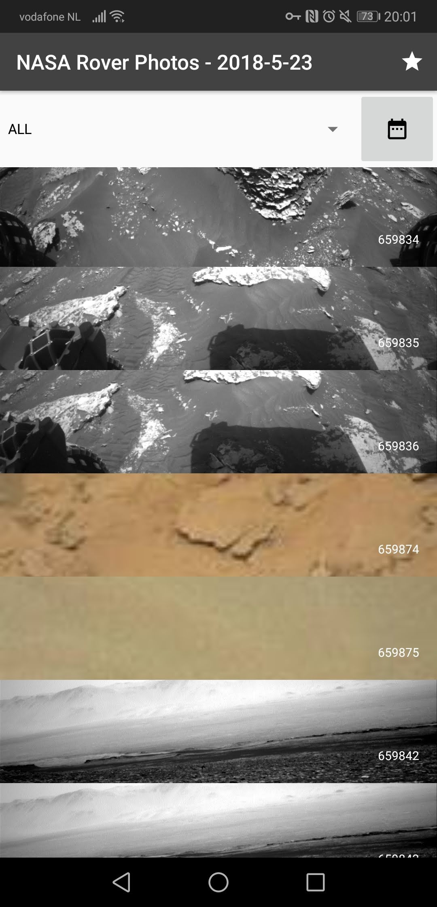
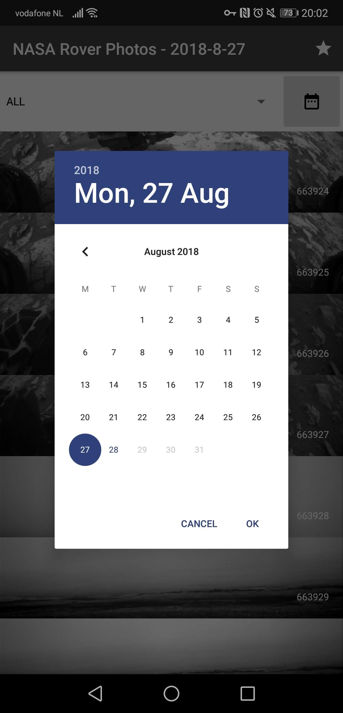
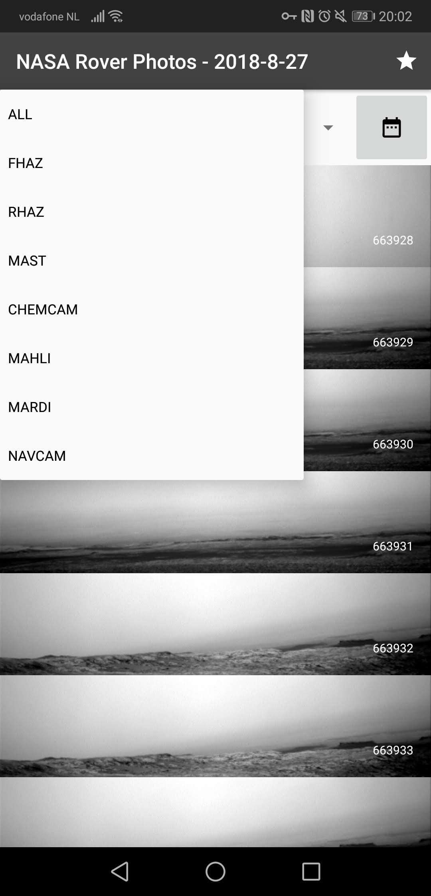
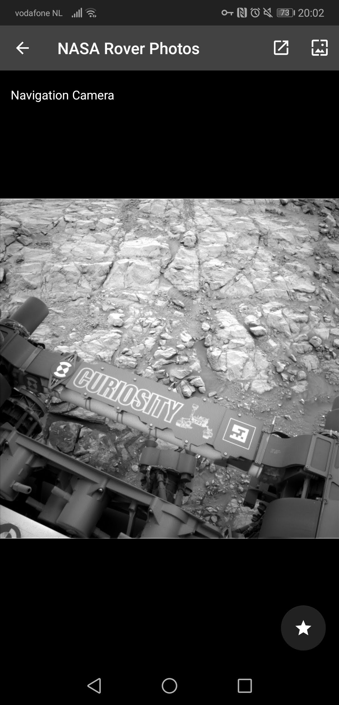

# Avans-Mars-Rover-Pictures
Nasa Rover Photos is a simple Android app to view photos taken by Curiousity, NASA's Mars Rover.

## Features

### Main Screen

### Look at photos per date

### Filter by Camera

### Favorite Photos

### Set photo as wallpaper or download

## Download
You can download the latest release from the [Releases Page](https://github.com/marc0tjevp/Avans-Mars-Rover-Pictures/releases)